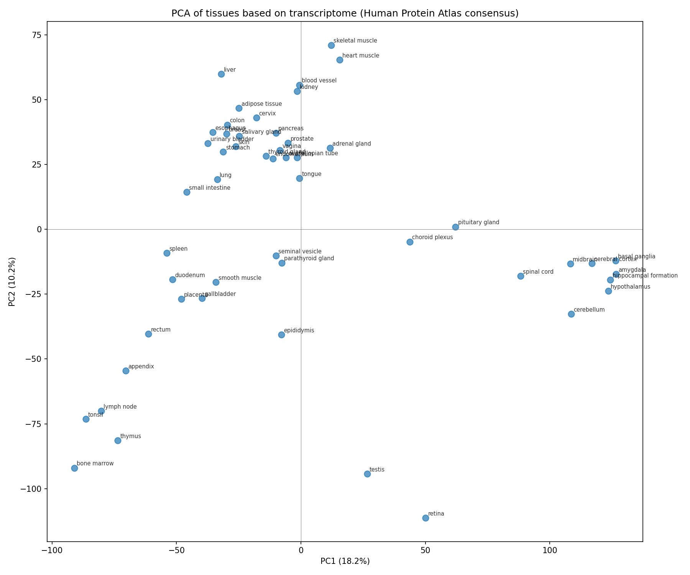
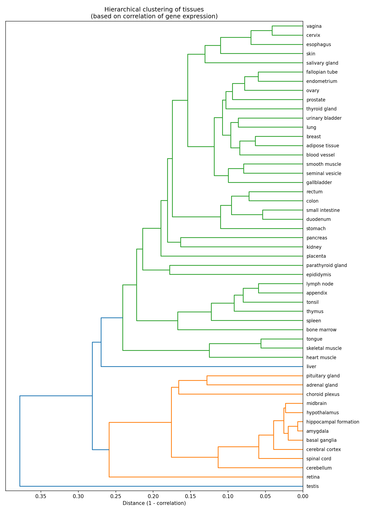
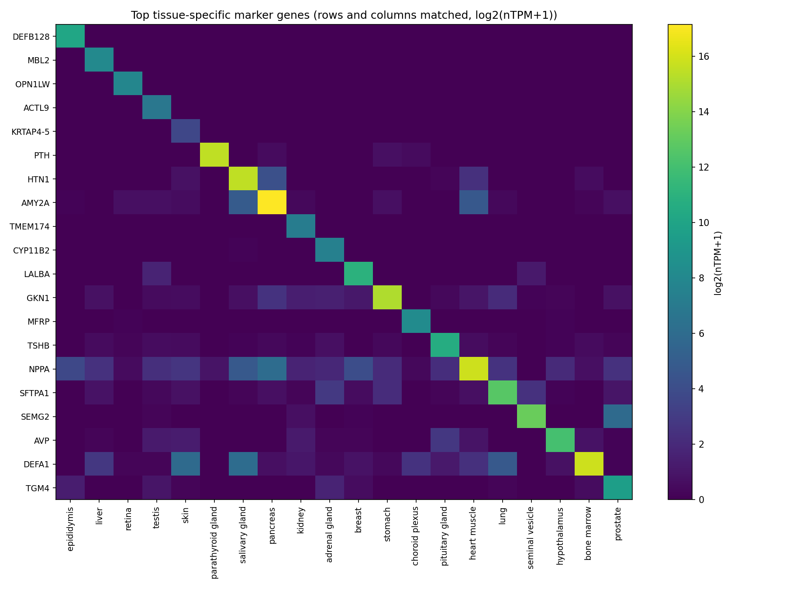

# ヒト組織別RNA-seq 組織特異的発現解析

Human Protein Atlasの公開RNA-seqデータを用いて、51種類のヒト正常組織の遺伝子発現パターンを比較し、組織特異的なマーカー遺伝子を同定する探索的解析プロジェクトです。

## この解析でやったこと

- 51組織 × 約20,000遺伝子の発現データをPCA・階層的クラスタリングで俯瞰し、脳領域・免疫系組織などが遺伝子発現パターンの類似性に基づいて自然にグループ化されることを確認
- 組織特異性スコア（Tau index）を用いて、各組織に固有のマーカー遺伝子を定量的に同定
- 解析の過程で「発現量が低い遺伝子ほどノイズによる見せかけの組織特異性が生じやすい」という問題に気づき、発現量フィルタを追加して対処
- データの前処理（条件に合う遺伝子の抽出）はSQL（SQLite）、統計解析（PCA・クラスタリング・Tau index）はPythonという役割分担で実装

## 技術スタック

| 用途 | 技術 |
|---|---|
| 前処理（低発現遺伝子・欠損遺伝子の除外） | SQL（SQLite、Python標準ライブラリのsqlite3） |
| 統計解析（PCA・階層的クラスタリング・Tau index） | Python（pandas, numpy, scikit-learn, scipy） |
| 可視化 | matplotlib |

前処理はGROUP BY・HAVING句を用いた条件抽出であり、SQLの得意分野に合致するため採用した。一方、PCA等の行列演算はSQL向きではないためPython側で実装しており、それぞれ適した箇所で適した技術を使う設計とした（詳細は[意思決定ログ](02_意思決定ログ.md)参照）。

## データについて

| 項目 | 内容 |
|---|---|
| データセット | Human Protein Atlas - RNA expression (consensus) |
| 提供元 | [Human Protein Atlas](https://www.proteinatlas.org/) |
| ライセンス | CC BY-SA 4.0（出典明記で自由に使用・改変・再配布可） |
| 内容 | 51組織 × 20,162遺伝子のnTPM（正規化発現量） |
| 取得元URL | https://www.proteinatlas.org/download/tsv/rna_tissue_consensus.tsv.zip |

このデータは組織ごとに集計済みの発現値であり、個体・サンプル単位の生カウントデータではありません。そのため、DESeq2等の古典的なDEG検定（群間有意差検定）ではなく、PCA・階層的クラスタリング・組織特異性スコアによる探索的解析を採用しています（理由の詳細は[決定の経緯](#決定の経緯とこの解析の設計思想)を参照）。

> 本リポジトリのデータは Human Protein Atlas (CC BY-SA 4.0) に基づきます。データの著作権は原著作者に帰属します。

## 解析結果

### 1. PCA：組織全体の俯瞰



51組織の発現パターンを2次元に圧縮したもの。点の距離が近いほど、2組織の遺伝子発現パターンが似ていることを意味します。脳の各部位（大脳基底核・扁桃体・海馬など）が一つのグループに、免疫系組織（骨髄・扁桃・リンパ節）が一つのグループにまとまりました。網膜(retina)と精巣(testis)は他のどの組織とも異なる、極めて特殊な発現パターンを示しました。

### 2. 階層的クラスタリング



相関距離に基づく階層的クラスタリングでも、PCAと整合する結果が得られました。中枢神経系のグループと、それ以外の組織のグループが最も大きな分岐として現れています。

### 3. 組織特異的マーカー遺伝子



組織特異性スコア（Tau index）が高く、かつ十分な発現量を持つ遺伝子を、組織ごとに1つずつ選んで可視化したものです。対角線上のマスだけが明るくなっており、各遺伝子がそれぞれの由来組織に特異的に発現していることが視覚的に確認できます。

代表的な結果として、以下は既知の生物学的知見と一致しています。

- **DEFA1**（骨髄）：59,493.5 nTPM、2位の胸腺（216.6 nTPM）の約275倍という圧倒的な特異性。好中球が産生するタンパク質で、好中球は骨髄で作られるため生物学的に妥当
- **ACTL9**（精巣）：精子形成に関わる既知の遺伝子
- **DEFB128**（精巣上体）：既知のディフェンシン遺伝子（Tauが同率1.0の候補が多数あったため、その中で最も発現量が高いものをタイブレークで採用）
- **MBL2**（肝臓）：既知の肝臓産生タンパク質

図の詳しい読み方は [figure_guide.md](figure_guide.md) を参照してください。

## 決定の経緯とこの解析の設計思想

この解析では、コードの実装だけでなく「なぜその手法・閾値を選んだか」を [意思決定ログ](02_意思決定ログ.md) に記録しながら進めました。特に重要な判断は以下の通りです。

1. **DESeq2ではなくPCA/クラスタリング/Tau indexを採用**：HPAのconsensusデータが組織ごとの集計値であり、反復サンプルの生カウントを前提とする古典的DEG検定を適用できないと判断したため。
2. **Tau indexに発現量フィルタ（最大nTPM≥10）を追加**：フィルタなしでは、そもそもどの組織でも発現量が極めて低い遺伝子（IFNA5/IFNA8など）が、測定誤差レベルの差でTau=1に近い値を示し上位を占めてしまう問題に気づいたため。フィルタ追加後、ACTL9やMBL2など既知のマーカー遺伝子が上位に来ることを確認し、フィルタの妥当性を検証した。
3. **欠損値のある119遺伝子は補完せず除外**：脳の細かい部位など特定10組織で構造的に欠損しているデータであり、平均値等での補完は実際には測定されていない発現パターンを人為的に作り出すリスクがあると判断したため。
4. **Tau同率時のタイブレークにmax_nTPM降順を採用**：Tau=1.0になる遺伝子が組織によっては多数存在し、SQLクエリの行順序に結果が依存する再現性の問題が発覚したため、発現量がより高い方を優先する明示的なルールを追加した（詳細は[意思決定ログ](02_意思決定ログ.md)参照）。

閾値などの暫定的な工学的判断には、それぞれ根拠と今後の検証課題を明記しています。詳細な経緯は [02_意思決定ログ.md](02_意思決定ログ.md) を参照してください。

## 再現方法

```bash
# 必要なライブラリ
pip install -r requirements.txt

# データを取得し、Numbers等の表計算ソフトを経由せずtsvのまま配置
# (表計算ソフトを経由すると行数制限でデータが欠落する場合があるため)
# https://www.proteinatlas.org/download/tsv/rna_tissue_consensus.tsv.zip

python analysis.py --input rna_tissue_consensus.tsv --outdir ./results
```

## ディレクトリ構成

```
.
├── analysis.py              # 解析の統合スクリプト
├── requirements.txt         # 必要なライブラリとバージョン
├── figure_guide.md           # 各図の読み方ガイド
├── 01_プロジェクト指示文.md    # プロジェクトの方針
├── 02_意思決定ログ.md          # 判断の経緯（日付・理由・根拠を記録）
├── 03_ナレッジベース.md        # プロジェクトの進捗状況まとめ
└── results/
    ├── pca_plot.png
    ├── dendrogram.png
    ├── marker_heatmap_diagonal.png
    ├── pca_result.csv
    └── tau_index_robust.csv
```

## 関連プロジェクト

- [PERG波形解析プロジェクト](https://github.com/buildwithsy/perg-waveform-analysis) - Pattern ERG（網膜電図）波形から特徴的なピークを自動検出する解析パイプライン。時系列信号のピーク検出という異なる解析軸でのスキルを示すプロジェクトです。

## ライセンス・出典

- 解析コード：MIT License
- 使用データ：Human Protein Atlas, [proteinatlas.org](https://www.proteinatlas.org/about/download), CC BY-SA 4.0
